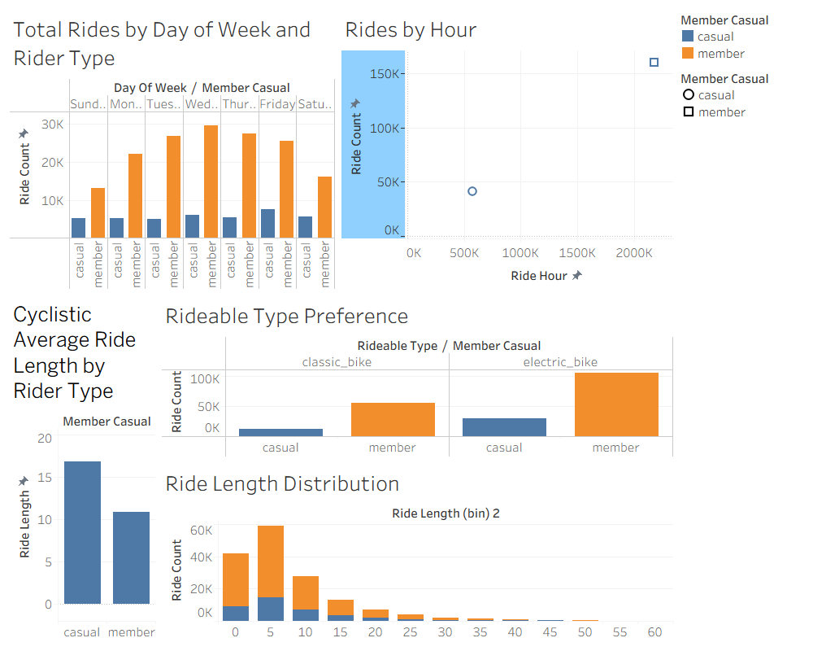

# Cyclistic Bike Share Analysis

## Project Overview
This project analyzes Cyclistic bike-share usage data to understand behavioral differences between casual riders and annual members. The goal is to identify insights that can help the company convert casual riders into annual members.

This case study follows the Google Data Analytics Capstone framework: Ask, Prepare, Process, Analyze, Share, and Act.

Tools used:
- Microsoft SQL Server (data cleaning and transformation)
- Tableau (data visualization)
- GitHub (project documentation)

---

# Business Problem

Cyclistic is a bike-share company that offers two types of users:

Casual riders
Annual members

Casual riders purchase single rides or day passes, while members pay for an annual subscription.

The marketing team wants to understand:

**How do casual riders and annual members use Cyclistic bikes differently?**

The goal is to design marketing strategies that convert casual riders into annual members.

---

# Data Source

Dataset: Cyclistic Bike Share Data  
Source: Divvy bike share public dataset

The dataset includes:

- ride_id
- rideable_type
- started_at
- ended_at
- start_station_name
- end_station_name
- start_lat
- start_lng
- end_lat
- end_lng
- member_casual

The dataset contains **201,450 rides** after cleaning.

---

# Data Cleaning Process (SQL)

The following steps were performed using Microsoft SQL Server:

### 1 Create Ride Length
# Cyclistic Bike Share Analysis

## Project Overview
This project analyzes Cyclistic bike-share usage data to understand behavioral differences between casual riders and annual members. The goal is to identify insights that can help the company convert casual riders into annual members.

This case study follows the Google Data Analytics Capstone framework: Ask, Prepare, Process, Analyze, Share, and Act.

Tools used:
- Microsoft SQL Server (data cleaning and transformation)
- Tableau (data visualization)
- GitHub (project documentation)

---

# Business Problem

Cyclistic is a bike-share company that offers two types of users:

Casual riders
Annual members

Casual riders purchase single rides or day passes, while members pay for an annual subscription.

The marketing team wants to understand:

**How do casual riders and annual members use Cyclistic bikes differently?**

The goal is to design marketing strategies that convert casual riders into annual members.

---

# Data Source

Dataset: Cyclistic Bike Share Data  
Source: Divvy bike share public dataset

The dataset includes:

- ride_id
- rideable_type
- started_at
- ended_at
- start_station_name
- end_station_name
- start_lat
- start_lng
- end_lat
- end_lng
- member_casual

The dataset contains **201,450 rides** after cleaning.

---

# Data Cleaning Process (SQL)

The following steps were performed using Microsoft SQL Server:

### 1 Create Ride Length
### 2 Extract Day of Week
### 3 Extract Ride Hour

---

# Key Analysis Questions

1 What days of the week have the highest ride activity?  
2 What time of day do users ride most?  
3 Do casual riders ride longer than members?  
4 Which bike type is most preferred by each user group?

---

# Visual Analysis

The following dashboards were created in Tableau:

1 Rides by Day of Week  
2 Rides by Hour  
3 Average Ride Length by Rider Type  
4 Rideable Type Preference  
5 Ride Length Distribution

---

# Key Insights

1 Casual riders have longer average ride durations compared to annual members.

2 Most rides occur during weekdays for members, suggesting commuting usage.

3 Casual riders show higher activity during weekends.

4 Electric bikes are the most preferred rideable type among both groups.

5 Ride activity peaks during evening hours.

---

# Business Recommendations

Based on the analysis, Cyclistic should consider the following strategies:

1 Introduce weekend membership promotions targeting casual riders.

2 Offer discounted annual memberships for frequent casual users.

3 Create marketing campaigns highlighting cost savings for regular riders.

4 Promote membership benefits during peak ride hours through in-app notifications.

---

## Tableau Dashboard

---

# Author

Varun Shaw  
Aspiring Data Analyst

